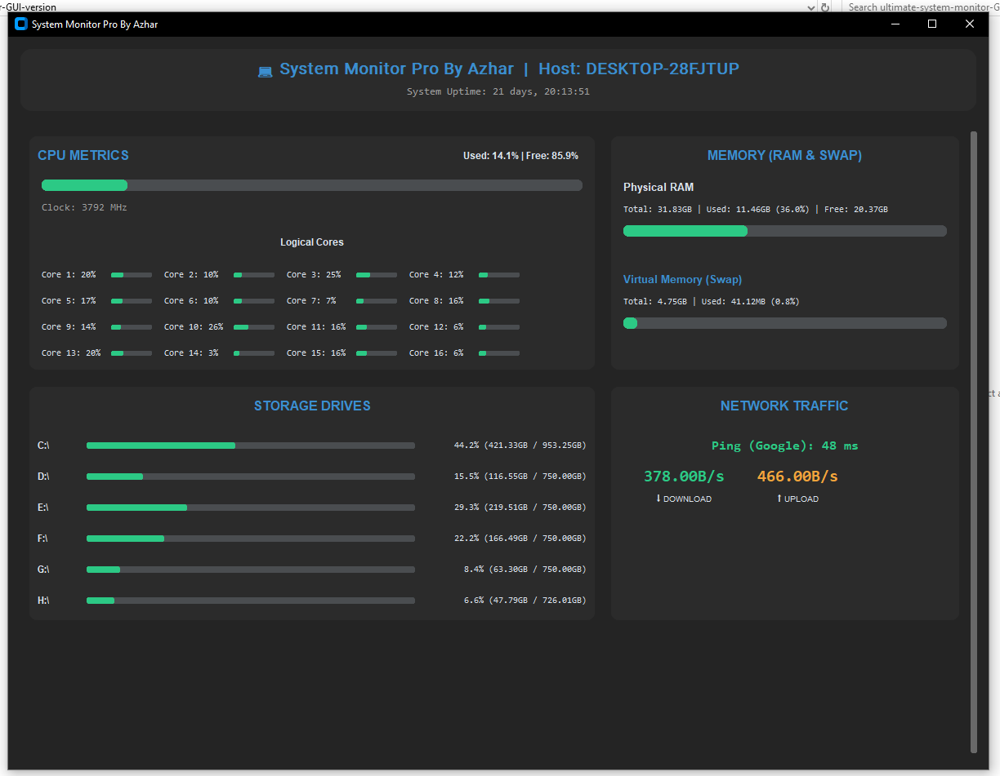

# System Monitor Pro — GUI Edition
By Md. Azharul Islam (@mdazharulislamnk)

System Monitor Pro — GUI Edition is a high-performance, real-time system tracking dashboard built with Python and CustomTkinter. It turns low-level hardware telemetry into a modern, responsive GUI for engineers, devs, and power users who need precise, low-latency visibility into CPU, memory, storage, and network health.



Highlights
- Modern dark UI (CustomTkinter) with high-DPI support
- Per-core CPU graphs (supports 32+ logical cores)
- RAM & Swap breakdown with numeric details
- Auto-detected multi-drive storage with capacity bars
- Real-time upload/download speeds and non-blocking TCP ping latency
- Configurable refresh rate, window size/position, and color theme
- Lightweight, low overhead — suitable for always-on monitoring

Table of contents
- Features
- Built With
- Preview
- Prerequisites
- Installation
- Usage
- Configuration
- CSV Logging (optional)
- Troubleshooting
- Contributing
- Author
- License

Features
- Modern Dark UI: sleek components and rounded corners using customtkinter.
- Deep CPU Analytics: total CPU load, current frequency (MHz), and per-core utilization bars.
- Memory Breakdown: physical RAM and virtual memory (swap) stats with used/free/total.
- Multi-Drive Storage: auto-discover mounted/attached drives and display usage in GB.
- Network Intelligence: real-time throughput (KB/s or MB/s) and threaded TCP ping to 8.8.8.8 to avoid UI freezes.
- Full Control: window size, start position, refresh rate, and colors are configurable from the top of the script.
- Low-latency: background threads for network checks, and optimized psutil usage to reduce overhead.

Built With (Technologies & Libraries)
- Language: Python 3.7+
- customtkinter — modern UI toolkit for Tkinter (dark mode & theming)
- psutil — system statistics (CPU, memory, disk, network)
- threading — non-blocking background tasks
- socket — TCP ping latency checks
- platform, time, datetime, os, sys, json, csv — standard library utilities

Preview
Add your GUI screenshot at assets/preview.png and it will render above. A small 1280×720 PNG works well for the README.

Prerequisites
- Python 3.7 or higher
- pip (Python package manager)

Installation
1. Clone the repository
```bash
git clone https://github.com/mdazharulislamnk/system-monitor-pro-gui.git
cd system-monitor-pro-gui
```

2. (Optional) Create and activate a virtual environment
```bash
python -m venv venv
# Windows
venv\Scripts\activate
# macOS / Linux
source venv/bin/activate
```

3. Install dependencies
```bash
pip install customtkinter psutil
```

Usage
Start the application:
```bash
python gui_monitor.py
```
The GUI will open at the configured position and begin live monitoring. Close the window or use the app's Quit button to exit.

Command-line flags
- --log : Start with CSV logging enabled (if implemented)
Example:
```bash
python gui_monitor.py --log
```

Configuration
Most user-customizable settings live in gui_monitor.py near the top in a CONFIGURATION section. Adjust these values and restart the app.

Window size & position
```python
WINDOW_WIDTH = 1200   # Width of the app window
WINDOW_HEIGHT = 900   # Height of the app window
WINDOW_X = 100        # Starting X position (px from left)
WINDOW_Y = 100        # Starting Y position (px from top)
```

Refresh rate (milliseconds)
```python
REFRESH_RATE = 1000   # 1000 ms = 1 second; lower = more frequent updates
```

Color theme (Cyber / Dark)
```python
COLOR_BG = "#1a1a1a"
COLOR_TEXT_HEADER = "#3B8ED0"
COLOR_GOOD = "#2CC985"
COLOR_WARN = "#F2A33C"
COLOR_CRIT = "#E04F5F"
```

Monitoring options (example config.json usage)
You may optionally provide a config.json alongside the script to toggle runtime behavior:
```json
{
  "refresh_rate_ms": 1000,
  "ping_target": "8.8.8.8",
  "ping_port": 53,
  "show_per_core": true,
  "logging_enabled": false
}
```
If config.json is present, the app will prefer values from the file over the embedded defaults.

CSV Logging (optional)
If logging is enabled, the app writes periodic rows to system_metrics.csv:
Columns (example): timestamp, cpu_total_pct, cpu_core_0_pct, ..., ram_used_mb, ram_total_mb, swap_used_mb, swap_total_mb, net_up_bps, net_down_bps, ping_ms

Troubleshooting
- ModuleNotFoundError: No module named 'customtkinter'
  - Run pip install customtkinter.
- Window too large for screen
  - Reduce WINDOW_WIDTH and WINDOW_HEIGHT in CONFIGURATION, or run on a screen with higher resolution.
- Ping shows "offline" but internet works
  - Firewall or antivirus may block outbound sockets. Allow Python or use a different ping_target in config.json.
- UI freezes briefly
  - Ensure background threading is enabled for network checks. Large refresh rates or very low intervals can increase CPU usage; increase REFRESH_RATE if needed.

Tips & Best Practices
- Use REFRESH_RATE >= 500 ms on modern machines; 1000 ms is a good default to balance overhead vs responsiveness.
- Disable per-core display on machines with many logical cores if you prefer a compact view.
- Use the CSV logs to build historical charts in Excel or Grafana (CSV import).

Contributing
Contributions and suggestions are welcome.
1. Fork the repo
2. Create a feature branch (git checkout -b feature/awesome)
3. Commit your changes and push (git push origin feature/awesome)
4. Open a pull request and describe your changes

Please follow PEP8 and include a short description in your PR.

Author
Md. Azharul Islam  
GitHub: https://github.com/mdazharulislamnk  
LinkedIn: Md. Azharul Islam

License
This project is released under the MIT License. See LICENSE for details.

Acknowledgements
- Thanks to the authors of psutil and CustomTkinter for enabling cross-platform system telemetry and modern Tkinter components.